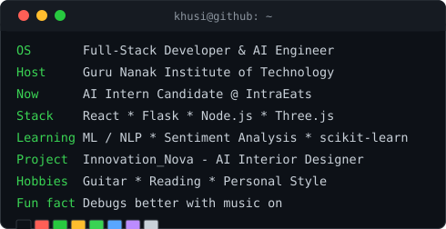

<div align="center">

<!-- Animated Banner -->


<!-- Typing animation -->
<a href="https://git.io/typing-svg">
  
</a>

<br/>

<!-- Social badges -->
<a href="https://linkedin.com/in/YOUR-LINKEDIN"></a>
<a href="mailto:your.email@example.com"></a>
<a href="https://twitter.com/YOUR-TWITTER"></a>
<a href="https://YOUR-PORTFOLIO.com"></a>
<a href="https://leetcode.com/YOUR-LEETCODE"></a>

<!-- Visitor counter -->


<br><br>

<h3><code>khusi@github ~ $ ./contributions.sh</code></h3>



<br><br>

<h3><code>khusi@github ~ $ whoami</code></h3>

<table>
  <tr>
    <td valign="top">
      
    </td>
    <td valign="top">
      
    </td>
  </tr>
</table>

<br>
</div>

---

### 👋 About Me

- 🎓 Final-semester student, deep into an accelerated academic schedule and loving the pressure
- 💻 I build **full-stack web apps** and **AI/ML-powered products**
- 🧠 Currently exploring **machine learning** — sentiment analysis, model evaluation, and everything in between
- 🚀 Always shipping something — check my **Featured Projects** below
- 🌱 Learning something new every single week
- ΓÜí Fun fact: I debug better with music on

```python
class Developer:
    def __init__(self):
        self.name = "Khusi Roy"
        self.role = "Full Stack Developer & AI Engineer"
        self.stack = ["Python", "JavaScript", "React", "Node.js"]
        self.currently_learning = ["Machine Learning", "System Design"]

    def say_hi(self):
        print("Thanks for stopping by! Let's build something great.")

me = Developer()
me.say_hi()
```

---

### 🛠️ Tech Stack

<div align="center">

**Languages**
<br/>


**Frontend & Frameworks**
<br/>


**Backend & Databases**
<br/>


**AI / ML**
<br/>


**Tools & Platforms**
<br/>


</div>

---

### 📊 GitHub Stats

<div align="center">


</div>

<details>
<summary>🏆 GitHub Trophies</summary>
<br/>
<div align="center">

</div>
</details>

---

### 🚀 Featured Projects

<div align="center">

<a href="https://github.com/khusiroyme-art/project-one">
  
</a>
<a href="https://github.com/khusiroyme-art/project-two">
  
</a>
<a href="https://github.com/khusiroyme-art/project-three">
  
</a>
<a href="https://github.com/khusiroyme-art/project-four">
  
</a>

</div>

| Project | Description | Tech Stack | Links |
|---|---|---|---|
| **Movie Sentiment Analyzer** | ML model classifying movie reviews as positive/negative with train/test evaluation pipeline | `Python` `scikit-learn` `Pandas` `NLTK` | [Repo](https://github.com/khusiroyme-art/movie-sentiment) |
| **Project Two Name** | One-line description of what it does and the problem it solves | `React` `Node.js` `MongoDB` | [Repo](https://github.com/khusiroyme-art/project-two) ┬╖ [Live Demo](https://your-demo-link.com) |
| **Project Three Name** | One-line description of what it does and the problem it solves | `Next.js` `Tailwind` `PostgreSQL` | [Repo](https://github.com/khusiroyme-art/project-three) ┬╖ [Live Demo](https://your-demo-link.com) |

---

### 🧠 AI / Machine Learning Focus

<table>
<tr>
<td width="60%">

I'm actively building ML fluency through hands-on projects:

- 📊 Sentiment analysis pipelines (train/test splitting, overfitting diagnosis, precision/recall/F1 evaluation)
- 🧮 Classical ML with `scikit-learn` (classification, regression, feature engineering)
- 🔤 NLP fundamentals — text vectorization, tokenization, embeddings
- 📈 Model evaluation and hyperparameter tuning
- 🤖 Exploring deep learning frameworks (`TensorFlow` / `PyTorch`)

</td>
<td width="40%">

</td>
</tr>
</table>

---

### 💻 Full Stack Focus

- 🌐 Building end-to-end web apps — React/Next.js frontends with Node.js/Django backends
- 🗄️ Comfortable across SQL and NoSQL databases
- 🔌 REST API design and integration
- ☁️ Basic deployment experience (Vercel, AWS, Docker)
- 🧪 Writing clean, testable, maintainable code

---

<div align="center">

### 💬 Let's Connect

I'm always open to collaborating on interesting projects, internships, or just talking tech.

<a href="https://linkedin.com/in/YOUR-LINKEDIN"></a>


</div>
